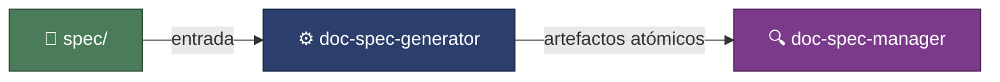
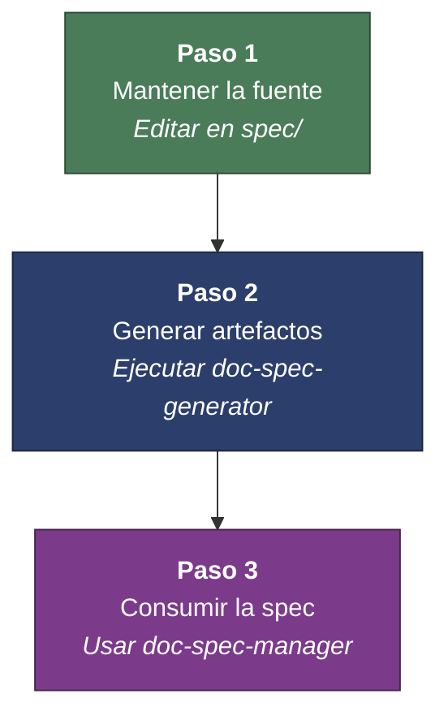

<p align="center">
  
</p>

# 🧩 DocSpec Pipeline

### Convertir documentación fuente extensa en conocimiento navegable y operativo para agentes de IA.


---

## Tabla de contenidos

- [🎯 Objetivo del repositorio](#-objetivo-del-repositorio)
- [🚫 Fuera de alcance](#-fuera-de-alcance)
- [⚙️ Skills incluidos](#️-skills-incluidos)
- [🔄 Flujo de trabajo recomendado](#-flujo-de-trabajo-recomendado)
- [📁 Estructura del repositorio](#-estructura-del-repositorio)
- [💡 Idea central](#-idea-central)

---

## 🎯 Objetivo del repositorio

El objetivo real de este repo no es conservar la documentación de negocio en bruto, sino proveer un flujo claro para que agentes de IA puedan trabajar con ella de forma confiable y escalable:



| Componente | Rol |
|:-----------|:----|
| `spec/` | **Fuente de entrada** — documentación de negocio en bruto. |
| `doc-spec-generator` | **Transformación** — atomiza la fuente en artefactos navegables. |
| `doc-spec-manager` | **Consumo** — consultas, trazabilidad y alineamiento con la spec. |

---

## 🚫 Fuera de alcance

El directorio `spec/` queda **fuera del scope principal** de este repositorio como producto final. Su función es servir como artefacto de trabajo y fuente documental para la generación posterior.

> [!IMPORTANT]
> El valor del repo está en los **dos skills** y en el flujo que habilitan, no en el contenido de `spec/`.
>
> - `spec/` **no** es la salida consumible por agentes.
> - `spec/` **no** representa el valor principal del repo.

---

## ⚙️ Skills incluidos

### 1. `doc-spec-generator`

Skill determinista que toma la documentación fuente ubicada en `spec/` y la atomiza en documentos pequeños, consistentes y manejables para consumo automatizado.

<details>
<summary><strong>📋 Responsabilidades</strong></summary>

- Fragmentar documentos grandes en archivos atómicos.
- Generar archivos índice (`head-*.md`) para navegación.
- Mantener consistencia estructural entre documentos fuente y artefactos generados.
- Validar integridad de referencias generadas.
- Guiar la creación o extensión de documentos en `spec/` para que sigan un formato parseable.

</details>

<details>
<summary><strong>🔑 Características clave</strong></summary>

- Implementación determinista.
- Basado en scripts Python, sin dependencia de LLM para la generación.
- Idempotente: la misma entrada produce la misma salida.
- Elimina artefactos huérfanos y reconstruye el conjunto de referencias.
- Trata `spec/` como única fuente de verdad.

</details>

<details>
<summary><strong>📥 Entradas y salidas</strong></summary>

| Dirección | Contenido |
|:----------|:----------|
| **Entrada** | Documentos fuente dentro de `spec/`. |
| **Salida** | Fragmentos atómicos dentro de `references/`. |
| **Salida** | Archivos cabecera `head-*.md` para cada tipo documental. |

</details>

<details>
<summary><strong>🛠️ Scripts principales</strong></summary>

| Script | Función |
|:-------|:--------|
| `generate_all.py` | Limpia, genera y valida. |
| `validate_references.py` | Valida integridad. |
| `extract_*.py` | Extraen fragmentos por tipo documental. |
| `gen_head_*.py` | Generan archivos índice y cabeceras. |
| `lib_parser.py` | Librería compartida de parsing. |

</details>

> [!TIP]
> **¿Cuándo usarlo?** Cuando cambie cualquier archivo en `spec/`, necesites regenerar referencias, quieras validar integridad de los artefactos, o necesites crear documentación fuente siguiendo reglas parseables.

---

### 2. `doc-spec-manager`

Skill orientado a la navegación eficiente de la especificación ya fragmentada. Permite a agentes de IA consultar, recorrer y verificar alineamiento con la documentación del proyecto sin depender de archivos monolíticos.

<details>
<summary><strong>📋 Responsabilidades</strong></summary>

- Navegar la especificación fragmentada por tipo de entidad.
- Consultar requisitos, bounded contexts, ADRs, stack, user stories y casos de uso.
- Verificar trazabilidad entre artefactos documentales.
- Ayudar a implementar funcionalidades alineadas con la especificación.
- Servir como interfaz de consulta sobre la salida generada por `doc-spec-generator`.

</details>

<details>
<summary><strong>🔀 Modos principales de uso</strong></summary>

| Modo | Descripción |
|:-----|:------------|
| **Implementación alineada** | Verificar que código y diseño respetan la especificación. |
| **Extensión de especificación** | Crear o ampliar entidades documentales manteniendo trazabilidad. |
| **Consulta** | Buscar y navegar información de forma rápida y precisa. |

</details>

<details>
<summary><strong>📦 Tipos de artefactos que navega</strong></summary>

| Artefacto | Identificador |
|:----------|:--------------|
| Requisitos funcionales | `RF` |
| Requisitos no funcionales | `RNF` |
| Requisitos no funcionales técnicos | `RNFT` |
| Bounded Contexts | `BC` |
| Architectural Decision Records | `ADR` |
| Stack tecnológico | — |
| User Stories | `US` |
| Use Cases | `UC` |

</details>

> [!TIP]
> **¿Cuándo usarlo?** Cuando vayas a implementar una funcionalidad y necesites alinearte con la spec, quieras seguir la cadena de trazabilidad, necesites consultar entidades documentales, o quieras validar consistencia antes de desarrollar.

---

## 🔄 Flujo de trabajo recomendado



1. **Mantener la fuente** — La documentación se edita en `spec/` únicamente cuando hace falta modificar la fuente.
2. **Generar artefactos navegables** — Se ejecuta `doc-spec-generator` para transformar la fuente en fragmentos atómicos.
3. **Consumir la documentación fragmentada** — Se usa `doc-spec-manager` para navegar, consultar y verificar la especificación generada.

---

## 📁 Estructura del repositorio

```
doc-spec-pipeline/
├── skills/
│   ├── doc-spec-generator/    # Skill de generación y scripts
│   └── doc-spec-manager/      # Skill de navegación y consulta
└── spec/                      # Insumo documental (fuera del scope principal)
```

---

## 💡 Idea central

Este repositorio no busca publicar una colección de documentos estáticos, sino establecer un **pipeline documental para agentes**:

1. Una fuente editable.
2. Una transformación determinista.
3. Una capa de consumo optimizada para IA.

> [!NOTE]
> En una sola línea: **convertir documentación fuente extensa en conocimiento navegable y operativo para agentes de inteligencia artificial.**